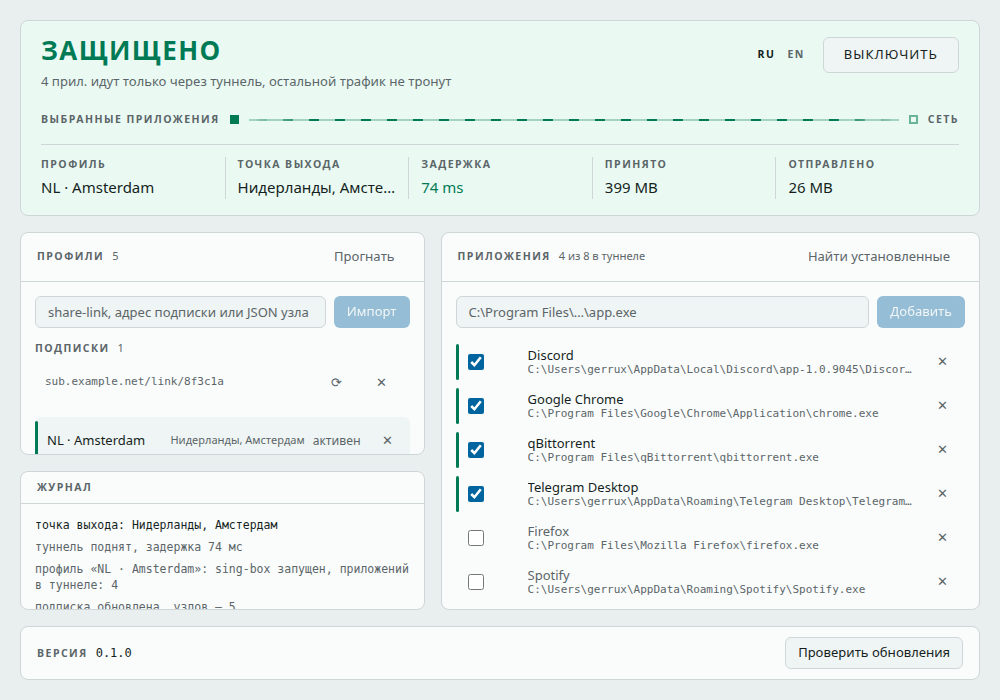
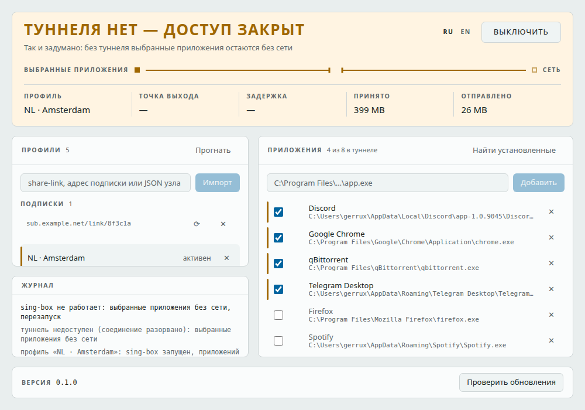
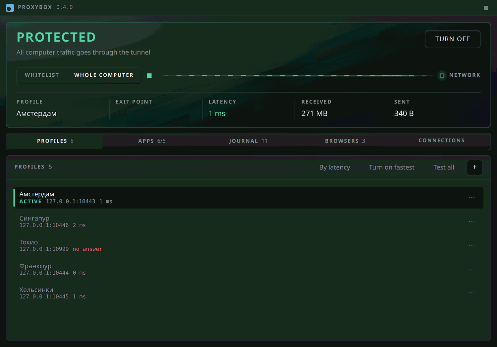

# Privacy Gateway

**Контроль исходящего трафика по принципу fail-closed.** Выбранные пользователем
программы ходят в сеть только через его туннель; туннеля нет — сети нет. Трафик
остальных приложений не трогается вообще.

Windows 10/11. Rust-ядро в воркспейс-крейтах, служба над ним, десктоп-оболочка
на Tauri 2.x, фронтенд — Vite + React + TS + Tailwind.

Техзадание — [privacy-gateway-prompt.md](privacy-gateway-prompt.md).



Состояние — главное, что показывает окно, поэтому оно и занимает верх. Под
заголовком нарисован сам путь: от выбранных приложений к сети. Пока туннель
поднят, по нему идут штрихи; когда его нет — канал перерублен и стоит.



Закрытый доступ янтарный, а не красный, и это не вкусовщина: fail-closed именно
так и обязан выглядеть, когда работает, — красным он читался бы как отказ
приложения. Красный остался ровно на одно: служба не отвечает или правила не
встали, то есть сломалось по-настоящему и нужен человек. Тем же цветом
подсвечены строки приложений — что происходит с каждым из них прямо сейчас,
видно там же, где список.

Интерфейс двуязычный — переключатель в шапке:



## Как это работает

Своей реализации протоколов у нас нет: туннель держит **sing-box**, как в
NekoBox. Мы разбираем share-link, собираем ему конфиг и следим за процессом.
Альтернативы (mihomo, Xray-core) померены `scripts/bench-cores.sh`: на vless+TLS
все три в пределах ±10% по памяти и CPU, так что ядро выбрано не за скорость, а
за перехват per-process прямо в конфиге и за Hysteria2, которых у Xray нет.

Перехват per-process — тоже конфиг, а не драйвер: TUN-вход sing-box плюс
правила маршрутизации по `process_path`. Выбранные приложения имеют ровно один
маршрут — `proxy`, запасного нет; всё остальное уходит в `direct`. Поэтому
недоступный сервер сам по себе означает «нет сети» для выбранных приложений.

Остаётся окно, когда sing-box не работает: пока процесса нет, TUN не поднят и
выбранные приложения ушли бы напрямую. На это время служба ставит блокирующие
правила брандмауэра Windows (`netsh advfirewall`) и снимает их только после
подтверждённой пробы туннеля.

```
                 да ─────────────► правила брандмауэра сняты, трафик в туннель
проба SOCKS5 ────┤
                 нет ────────────► блокирующие правила на выбранные .exe
```

## Структура

```
crates/
  core-ipc/          контракт службы ↔ клиенты + клиентский вызов call()
  core-apps/         автообнаружение приложений (каталог, ярлыки «Пуска», реестр,
                     пакеты MSIX, запущенные процессы) и их иконки
  core-config/       share-link (vless/vmess/trojan/ss/hy2/wg) и тело подписки
                     → узел sing-box
  core-tunnel/       генерация конфига sing-box, запуск и присмотр, проба, трафик
  core-filter/       политика fail-closed + правила брандмауэра на выбранные .exe
  pg-service/        служба: состояние, процесс sing-box, надзор раз в 3 с;
                     на Windows — служба SCM (install/uninstall в ней же)
  pg-cli/            бинарник privacy-gateway — headless-клиент контракта
src-tauri/           Tauri 2.x оболочка (отдельный Cargo-проект, сборка только
                     на Windows); пробрасывает запросы фронтенда в core-ipc
ui/app-shell/        Vite+React+TS+Tailwind: статус, профили, приложения, журнал
resources/apps/      каталог-дополнение к реестру: консольные инструменты и то,
                     что не регистрируется (catalog.v1.json, вшит в core-apps)
installer/           hooks.nsh (регистрация службы) и build.ps1 (сборка установщика)
scripts/e2e.sh       сквозная проверка на своём же sing-box-сервере
scripts/bench-cores.sh  сравнение ядер (sing-box / mihomo / Xray) на одном стенде
```

## Быстрый старт на Windows

Двойной клик по `run.bat` — он проверит окружение, при необходимости скачает
sing-box, поставит зависимости и предложит: запустить службу с окном приложения,
запустить службу с интерфейсом в браузере, собрать установщик, прогнать тесты
или проверить окружение (`doctor`).

Службе нужны права администратора — TUN и правила брандмауэра иначе не поднять;
`run.bat` об этом предупредит, если запущен без них.

## Требования

- Rust toolchain; Node + [pnpm](https://pnpm.io) 9+
- **sing-box** рядом с бинарником службы (`sing-box.exe`), в `PATH` или по пути
  из `PG_SINGBOX`. В установщик кладётся вместе со службой.
- Для десктоп-сборки (только Windows) — Tauri CLI 2.x
  (`cargo install tauri-cli --version "^2"`), MSVC/VS Build Tools, WebView2.
  На Linux нет webkit2gtk — `src-tauri` не собирается, ядро и фронтенд собираются.

## Разработка

```bash
pnpm install
cargo run -p pg-service                       # служба (терминал 1)
cargo run -p pg-cli -- add-profile --link 'vless://…'
cargo run -p pg-cli -- add-profile --link 'https://панель/sub'  # подписка целиком
cargo run -p pg-cli -- discover                # найти установленные приложения
cargo run -p pg-cli -- enable --path 'C:\…\chrome.exe'
cargo run -p pg-cli -- on --profile myvpn
cargo run -p pg-cli -- status
cargo run -p pg-cli -- test                    # прогнать профили: кто отвечает
cargo run -p pg-cli -- add-browser --name работа --node myvpn --lang auto
cargo run -p pg-cli -- browsers                # браузерные профили и их сеансы
cargo run -p pg-cli -- browse --profile работа # свой прокси под профиль: адрес
                                               # для --proxy-server браузера
cargo run -p pg-cli -- browse --stop --profile работа  # погасить этот сеанс
cargo run -p pg-cli -- settings                # настройки службы: что действует
cargo run -p pg-cli -- settings --geo off      # не спрашивать страну у сервиса
cargo run -p pg-cli -- doctor                  # почему не работает: окружение

pnpm --filter app-shell dev                   # фронтенд на :5173; дев-сервер
                                              # сам ходит в службу (см. vite.config.ts),
                                              # так интерфейс живой и без Tauri
cargo tauri dev                               # окно с фронтендом (Windows)

pnpm validate                                 # lint + build + cargo test
cargo check --workspace --target x86_64-pc-windows-msvc   # проверка windows-веток
PG_SINGBOX=/путь/к/sing-box scripts/e2e.sh    # сквозная проверка, нужен sing-box
scripts/settings.sh                           # настройки: правка, диск, окружение
```

`scripts/e2e.sh` поднимает собственный vless-сервер, импортирует ссылку на него,
включает приватный режим, проверяет что трафик идёт через туннель и что после
убийства сервера соединения перестают проходить.

Переменные: `PG_SINGBOX` — путь к бинарнику, `PG_TUN=0` — не поднимать TUN,
`PG_PROBE=host:port` — цель пробы (по умолчанию сам сервер профиля, чтобы не
трогать сторонние адреса), `PG_GEO=0` — не спрашивать точку выхода,
`PG_REFRESH=0` — не сверять подписки по расписанию.

Четыре из них — `PG_SINGBOX`, `PG_PROBE`, `PG_GEO`, `PG_REFRESH` — теперь есть
и настройками: в окне и в `privacy-gateway settings`. Переменная сильнее
настройки, и служба говорит об этом строкой в журнале при старте; на диск
перебивка не уходит — она живёт ровно столько, сколько выставлена переменная.
`scripts/settings.sh` проверяет это без sing-box.

В `%APPDATA%\privacy-gateway\`: `state.json` — профили, приложения и последнее
измеренное про каждый профиль,
`singbox.json` — сгенерированный конфиг, `singbox.log` — вывод sing-box
(последняя строка попадает в журнал службы, когда запуск не удался).

`doctor` проверяет не свой код, а внешние причины: отвечает ли служба, найден ли
sing-box, работает ли служба Base Filtering Engine (без неё `netsh` не поставит
блокирующие правила), запущено ли всё от администратора, не включён ли системный
прокси и не подняты ли чужие TUN/VPN-адаптеры — они спорят за маршруты с нашим
`strict_route`. Провал хотя бы одной проверки — ненулевой код возврата.
Единственная команда, которая работает без службы: она нужна ровно тогда, когда
служба молчит.

## Если что-то не работает

- **Tauri пишет «Waiting for your frontend dev server»**, хотя vite уже поднялся —
  выключите сторонний VPN: подняв свой TUN, он перехватывает в том числе пробы
  на 127.0.0.1, и Tauri не видит дев-сервер. По той же причине `doctor`
  предупреждает о чужих поднятых TUN/VPN-адаптерах.
- **«Служба не отвечает»** — она не запущена или запущена без прав
  администратора. `run.bat` от имени администратора, либо `sc query PrivacyGateway`.
- **`configure tun interface: Access is denied`** и `netsh … requires elevation`
  — это одно и то же: службу запустили без прав администратора. Ни TUN, ни
  правила брандмауэра без них не поднимаются, а без них приватного режима нет.
- **Первая же команда — `privacy-gateway doctor`**: он проверяет права, службу,
  sing-box, Base Filtering Engine, системный прокси и чужие туннели.

## Подписки

Подписка — это тот же импорт: в поле профилей вставляется `https`-адрес, и
служба заводит профиль на каждый узел из ответа. Отдельной команды на обновление
нет — повторный импорт того же адреса и есть обновление, поэтому в окне у
подписки только «⟳» и «✕».

Обновление заменяет набор целиком: узел, которого в подписке больше нет, уходит
и из списка. Живой туннель при этом не гасится ради самой замены — иначе между
снятыми правилами и поднятым заново sing-box выбранные приложения успевали бы
уйти напрямую. Активный узел трогается только по делу: вернулся с другими
параметрами — туннель перезапускается, исчез совсем — останавливается. Профили,
добавленные ссылкой вручную, подписка не трогает.

Кроме нажатия, подписки сверяются сами — раз в шесть часов, отдельным потоком
(запрос к панели длится до двадцати секунд, и присмотр за туннелем не может на
это время встать). Фоновая сверка отличается от нажатия ровно одним: если
активный узел из подписки исчез, приватный режим **остаётся включённым** без
туннеля, то есть выбранные приложения остаются без сети. Выключить режим за
спящего пользователя значило бы вернуть его приложения в открытую сеть по
решению панели, а не его собственному; нажатие — другое дело, там человек видит,
что узла больше нет. Сверка отключается в настройках либо `PG_REFRESH=0`.

Понимаем три формата тела: список ссылок открытым текстом, он же целиком в
base64 (так отдаёт большинство панелей) и Clash-YAML — его панели раздают по
знакомому User-Agent, а некоторые только его и умеют. Строка или узел, которые
не разобрались, пропускаются — из-за одного незнакомого протокола терять всю
подписку не за что. Пустой ответ считается ошибкой адреса, и старые профили в
этом случае остаются на месте.

Своей модели протоколов у нас нет, поэтому узел из YAML не собирается в конфиг
sing-box напрямую, а превращается обратно в share-link: дальше его разбирает тот
же код, что и обычную подписку, и знать про Clash больше ничему не нужно.
Разбирается подмножество YAML, которым и написан `proxies:`; узел с якорем или
многострочным скаляром пропадёт — видно по числу узлов.

Скачивание идёт через поднятый туннель, если он есть: панель, закрытую
провайдером, напрямую не достать, да и её адрес незачем показывать провайдеру.
Туннеля нет (а при первом импорте его и не бывает) — идём напрямую; не вышло
через туннель — пробуем напрямую, потому что отказ панели от блокировки здесь
не отличить. В охвате «весь компьютер» другого пути и нет: kill-switch
запрещает исходящий всем, кроме sing-box, и прямой запрос службы туда не
пролез бы.

## Браузерные профили

Вкладка «Браузеры» — отдельный список: браузерный профиль это не узел. Узел даёт
адрес, каталог сеанса — куки и входы, `ua` с `lang` — то, что о браузере узнаёт
сайт. На один узел их бывает несколько, иначе два аккаунта через одну страну не
развести. В CLI — `browsers`, `add-browser --name <имя> --node <профиль>
[--ua <строка>] [--lang <языки>]`, `remove-browser --name <имя>`.

Кнопка «Открыть» (в CLI — `browse --profile <имя браузерного профиля>`) поднимает
под узел этого профиля отдельный локальный прокси и открывает окно браузера через
него. Общий режим при этом не трогается: у инстанса свои порты, свой каталог и
**нет TUN**. Так и задумано — второй TUN с `auto_route` и `strict_route`
перехватил бы и исходящее соединение основного sing-box, туннели выстроились бы в
цепочку, и к задержке добавился бы целый RTT до чужого сервера. TUN держит ровно
один инстанс, общий режим.

Сеансов бывает несколько разом, по одному на браузерный профиль: два окна в двух
странах работают одновременно и друг о друге не знают. Каталог у каждого свой
(`browser/<имя>` с хвостом-хешем от имени) — `Tunnel::start` добивает процесс из
`singbox.pid`, и общий каталог означал бы, что каждый новый сеанс гасит
предыдущий. Порты тоже свои, `free_port()` на каждый.

Правил по `process_path` у этих инстансов нет: в туннель идёт тот, кто сам указал
прокси, — браузер запускается с `--proxy-server=socks5://127.0.0.1:<порт>` и своим
`--user-data-dir`. Каталог данных обязателен по двум причинам сразу: без него
Chromium передаёт аргументы уже запущенному окну и открывает обычную вкладку мимо
прокси, и он же делает профили независимыми — свои входы у каждого. Отсюда и
главная неожиданность: окно открывается **чистым**, закладок и входов из обычного
Chrome в нём нет. Свои оно помнит до следующего раза, а удаление профиля стирает
их вместе с ним.

Прямого доступа этот путь не даёт ни на такт: умрёт его sing-box — браузер
останется без сети, прокси откажет. Закрытие окна службе не видно — она видит
живой процесс, а тот переживает браузер легко, — поэтому закрытия дожидается
оболочка и сама шлёт `browse-stop`. Отдельной кнопки «закрыть» нет за
ненадобностью; в CLI есть `browse --stop --profile <имя>`, там ждать некому.

Браузер запускает окно приложения, а не служба: служба работает в сессии 0, и её
окон человек не увидит. Ищется Chromium — Chrome, Edge, Brave, Яндекс; Firefox и
Tor не подойдут, `--proxy-server` понимают только первые.

### Что видит сайт

`--force-webrtc-ip-handling-policy=disable_non_proxied_udp` — не украшение. SOCKS5
у Chromium везёт TCP, а WebRTC собирает кандидатов по UDP с настоящих
интерфейсов: без этого флага STUN-запрос уходит мимо прокси и сайт видит
настоящий адрес человека при поднятом туннеле.

`--user-agent` меняет строку запроса и `navigator.userAgent`. Кнопка
«Сгенерировать» держится Windows и версии Chrome рядом с настоящей (её узнаёт у
самого вебвью), а хвост версии оставляет `0.0.0`: с версии 110 Chrome обнуляет
его сам, и настоящий номер сборки в строке был бы аномалией. «Уникальный» здесь
значит «не такой, как у соседнего профиля», а не «единственный такой в
интернете» — второе как раз и выдаёт.

`Accept-Language` Chromium берёт не из аргументов, а из `Preferences` профиля,
поэтому язык кладётся туда до запуска. `auto` означает «по стране узла», как оно
и устроено у Dolphin Anty; страна известна из прогона профилей.

Дальше начинается то, чего флагами не сделать, и врать об этом не будем:
`Sec-CH-UA` и `navigator.userAgentData` Chromium собирает из настоящей сборки,
часовой пояс берёт из системы, а canvas, WebGL, WebGPU, ClientRects, аудио, экран
и `hardwareConcurrency` одинаковы у всех профилей одной машины. Это разделение
аккаунтов — свой адрес, свои куки, своя строка UA, — а не антидетект: тот
делается патченным Chromium, а не набором ключей командной строки.

## Прогон профилей

Кнопка «Прогнать» в шапке списка профилей (в CLI — `privacy-gateway test`)
проверяет каждый профиль и показывает рядом с ним задержку или причину отказа,
а у ответивших — ещё и точку выхода: страну с городом, как их видит внешний
сервис. Иначе узнать, куда профиль на самом деле ведёт, нечем — имя узла в
подписке пишет панель, и совпадать с географией оно не обязано. Спрашивается
она тем же запросом и тем же выключателем («спрашивать страну» в настройках
либо `PG_GEO=0`), что и у живого туннеля,
пока проверочный sing-box ещё не остановлен: поднимать ядро второй раз ради
страны дороже самой пробы.

Проверка идёт **мимо живого туннеля**, а не через него: на каждый профиль
поднимается отдельный sing-box — без TUN, без правил по `process_path`, на
свободных портах и в своём каталоге. Он не трогает ни маршруты системы, ни
брандмауэр, поэтому прогон не может оставить пользователя без сети и не сдвигает
fail-closed основного туннеля ни на такт. Отдельный каталог тут обязателен:
`Tunnel::start` добивает процесс из `singbox.pid`, и общий каталог означал бы,
что прогон убивает как раз тот туннель, который проверяет.

Профили проверяются по очереди, поэтому ответ службы приходит через секунды —
окно на это время показывает «ждём», а кнопка заперта: два прогона делят
каталог проверки.

Итог прогона переживает перезапуск службы (`state.json`): узел из страны в
страну не переезжает, а платить за уже известное секундами прогона на профиль —
значит показывать пустую строку там, где ответ есть. Неудачный прогон стирает
задержку, но не страну: молчит узел сегодня, а стоит там же. Задержка стареет
быстрее — поэтому рядом хранится время измерения, и в окне оно видно подсказкой
(«Измерено 3 ч назад»). У активного профиля цифра живая: её обновляет тот же
надзор, что и верх окна.

Страну окно показывает флагом, полное название — подсказкой: в строку профиля
«Нидерланды, Амстердам» не помещается, а флаг читается быстрее любой надписи.

Глифы флагов приходится везти с собой: в Windows их нет — Segoe UI Emoji флагов
не содержит, и «🇳🇱» система рисует двумя буквами в квадратиках. В сборке лежит
78 КБ «Twemoji Country Flags» — подмножество Twemoji Mozilla (1,5 МБ) ровно по
флагам, с `unicode-range` на региональные индикаторы: на другие знаки шрифт не
подставляется и не грузится, пока флага нет на экране. Наружу за ним не ходят.
Заодно флаги появились в именах профилей из подписок: их принято начинать
флагом, и до сих пор это были те же квадратики.
Рисунок — Twemoji © Twitter, CC-BY 4.0; сборка шрифта — TalkJS, MIT.

## Язык

Русский и английский — переключатель в настройках, за кнопкой в титульной
полосе. Язык хранится в службе, а не в окне: сообщения журнала пишет она, и
переключать их отдельно от интерфейса бессмысленно. Уже написанные строки журнала не переводятся задним числом — это
запись того, что было сказано, а не текущее состояние.

CLI берёт язык у службы; `PG_LANG=en` перебивает его для одного запуска и задаёт
язык там, где службы ещё нет — в подсказке по командам и в `doctor`.

## Настройки

Кнопка в титульной полосе окна; в CLI — `privacy-gateway settings`. Там лежит
всё, что читают раз в месяц, а не раз в минуту:

- **охват** — «выбранные приложения» либо «весь компьютер». Стоял над списком
  приложений, а живёт здесь: «весь компьютер» — это отсутствие отбора, а не
  отбор целиком, и список в этом режиме не применяется вовсе;
- **запуск с Windows** — окно стартует с системой и сразу уходит в трей
  (`HKCU\…\Run`, значение с `--hidden`). Службы это не касается: она в SCM и
  поднимает туннель без всякого окна, автозапуск нужен значку — иначе о
  запертой машине в интерфейсе нет ни следа;
- **сверка подписок**, **запрос страны**, **цель пробы** и **путь к sing-box** —
  то, что раньше было только переменными окружения, то есть было у того, кто
  продукт собрал, и не было у того, кто его установил;
- **язык** и **версия с обновлениями**.

Переменная окружения по-прежнему сильнее настройки: ею пользуются e2e и
разработка, и молча проиграть сохранённому полю она не должна. Окно показывает
действующее значение, служба говорит о перебивке строкой в журнале при старте, а
на диск перебивка не уходит — иначе она пережила бы ту сессию, в которой
переменную выставили.

Ни одна настройка не гасит туннель ради себя: путь к sing-box действует со
следующего запуска, цель пробы и страна — со следующего измерения, сверка
подписок — со следующего круга. Перезапуск ради настройки означал бы выбранные
приложения без сети на ровном месте.

## Принципы

- **Fail-closed:** промежуточных состояний с прямым доступом не существует.
  Нет туннеля — DROP. Никаких bypass-правил.
- **Привилегии только в службе.** GUI и CLI — тонкие клиенты `core-ipc` от
  обычного пользователя, своего состояния у них нет. На Windows связь идёт по
  именованному каналу со списком доступа: SYSTEM и администраторы полностью,
  интерактивные пользователи — чтение и запись, процессы низкой целостности
  (песочницы браузеров) — никак.
- **Наружу — один адрес, и тот выключается:** ни телеметрии, ни логов трафика.
  Проба идёт на сервер самого пользователя. Единственная третья сторона —
  `ip-api.com`, у которого спрашивается точка выхода: в момент подъёма туннеля
  и по разу на профиль в прогоне — то есть только когда об этом попросили.
  Запрос идёт **через туннель**: сервис видит адрес вашего сервера, а не ваш —
  и потому при выключенном приватном режиме страны в окне нет вовсе. Показать её
  там означало бы спросить с настоящего адреса ровно тогда, когда он ничем не
  прикрыт. Выключается настройкой «спрашивать страну» либо `PG_GEO=0`. За обновлениями окно ходит на `api.github.com`
  только по нажатию кнопки — само, в фоне, ни разу.
- **TS strict** во фронтенде.

## Установка на Windows

Готовый установщик — в [релизах](https://github.com/Gerrux/proxybox/releases):
их собирает `.github/workflows/release.yml` из тега `vX.Y.Z` тем же скриптом,
что и сборка руками.

Сборка и выпуск — [src-tauri/BUILD-WINDOWS.md](src-tauri/BUILD-WINDOWS.md).
Установщик (NSIS, per-machine) кладёт окно, службу, CLI и sing-box в одну папку
и вызывает `pg-service.exe install`: служба `PrivacyGateway` под LocalSystem с
автозапуском. Удаление вызывает `pg-service.exe uninstall` — остановка службы
снимает блокирующие правила, и только потом служба удаляется из SCM.

Остановка службы командой (`sc stop`, удаление) снимает правила брандмауэра:
это осознанное действие администратора. Падение службы правила НЕ снимает —
там fail-closed важнее удобства, а при следующем старте она приберёт сама.

## Обновления

В настройках — версия и кнопка «Проверить обновления»: она забирает с
`api.github.com` **весь** список релизов, показывает, что вышло, и открывает в
браузере установщик нужного — в том числе прежней версии, если новая не
подошла. Само окно наружу не ходит: пока не нажали, запроса нет. Нашлось что-то
новее — в титульной полосе появляется кнопка «Обновить до …», и она же ведёт
обратно в настройки.

Скачанное ставит человек. Приложение живёт в `Program Files` и переустанавливает
службу под LocalSystem — молча подменять собственную привилегированную часть
скачанным файлом, пока у проекта нет сертификата, оно не будет.

## Что помнит служба

Профили, список приложений и **включённость приватного режима** переживают
перезапуск: после перезагрузки машины служба сама поднимает последний профиль,
причём блокирующие правила ставятся до туннеля, а не после — иначе между
загрузкой системы и подключением было бы окно прямого доступа. Выключение
запоминается так же: выключили — после ребута туннель не поднимется.

## Другой VPN рядом

Не запускайте два туннеля одновременно. Наш TUN назван «Privacy Gateway» и
живёт в 172.27.234.0/30, а не в 172.19.0.1/30 — умолчании sing-box, NekoBox,
Hiddify и v2rayN, — поэтому лобового столкновения имён и адресов не будет.

Но маршрут по умолчанию в системе один, и два TUN за него спорят. Если чужой
туннель выиграет, трафик выбранных приложений уйдёт в него — а наш статус
останется «Защищено», потому что проба ходит через свой локальный вход и
по-прежнему проходит. Это единственный известный случай, когда окно говорит
неправду. Поэтому служба при подъёме туннеля пишет в журнал, что рядом поднят
чужой, а `doctor` предупреждает об этом заранее.

## Чего ещё нет

- Охват дочерних процессов работает по пути к exe: браузер со своими рендерерами
  попадает под правило целиком, а вот запущенный из выбранного приложения ДРУГОЙ
  exe — нет. Родительские связи не отслеживает ни sing-box, ни правила
  брандмауэра; для этого нужен свой WFP-фильтр.
- Выборочность стоит процессора. Правило по `process_path` заставляет sing-box
  определять процесс-владелец для каждого нового соединения в системе, а не
  только для выбранных приложений: через TUN идёт весь трафик, и до
  `final: direct` его сначала надо провести мимо этого правила. На Windows
  определение процесса — перебор таблицы соединений, то есть тем дороже, чем
  больше сокетов открыто. Клиенты, которые гонят в туннель всё подряд и
  процессов не различают, этой цены не платят вовсе — и охват «весь компьютер»
  её тоже не платит: там `process_path` не сверяется ни разу. Дешёвого обхода
  для выборочного охвата нет, он и есть причина расхода.
- Автообнаружение ищет в окружении того, кто нажал: `%USERPROFILE%`, `%APPDATA%`,
  `%LOCALAPPDATA%` и `PATH` приходят от клиента (окно и CLI работают от имени
  человека, служба — от LocalSystem). Клиент постарше их не пришлёт, и тогда
  служба по-прежнему перебирает все профили из `ProfileList`, считая их
  подкаталоги стандартными, — на общей машине в списке окажутся чужие
  приложения, а перенесённый политикой AppData не найдётся. Правила брандмауэра
  всё равно ставятся по пути, то есть на всю машину: это про то, что человеку
  предлагают, а не про то, кого блокируют.
- Правило sing-box по `process_path` сверяет путь побайтово, поэтому в конфиг
  и в брандмауэр уходят два варианта пути: записанный и приведённый к виду
  файловой системы. Если Windows покажет процесс третьим способом (том без
  буквы, монтированный каталог), правило снова не совпадёт — и промах этот
  тихий: приложение уходит мимо туннеля, не переставая считаться защищённым.
- Автообнаружение видит только вошедших в систему пользователей: ветка реестра
  вышедшего лежит файлом `NTUSER.DAT` и требует `RegLoadKey` с
  `SeRestorePrivilege`, а мы читаем то, что уже загружено в `HKEY_USERS`.
- Запись `Uninstall` без `DisplayIcon` находится по `InstallLocation`, но только
  когда exe там опознаётся бесспорно: имя совпало с именем программы или exe в
  каталоге один. Иначе программа не найдётся — угаданный не тот exe в туннеле
  хуже ненайденного.
- Запущенные процессы попадают в список все, кроме начинки Windows
  (`%SystemRoot%`): служба под LocalSystem видит и чужие сеансы, и служебное
  ПО. Имя тут — имя файла, человеческого взять неоткуда.
- Ярлыки меню «Пуск» разбираются только до `LocalBasePath`: цель на сетевом
  диске и цель, записанная в кодовой странице системы, пропускаются.
- Приложения из Store и winget (`Program Files\WindowsApps`) ищутся обходом
  самого каталога: список пакетов есть и в реестре, но тот ключ виден только
  SYSTEM, а манифест всё равно пришлось бы читать — только он знает, какой exe в
  пакете главный. Пакет без плитки в «Пуске» пропускается целиком.
  Обновление пакета переносит exe в папку с новой версией, и оба слоя перехвата
  знают приложение по пути: службе приходится переспрашивать путь — на старте и
  раз в цикл надзора, то есть окно утечки тут то же, что и у падения sing-box.
  Правило брандмауэра со старым путём при этом остаётся висеть: снимается оно по
  тому же пути, по которому ставилось, а того уже нет в списке. Вреда от него
  нет, пока пакет не откатят ровно на прежнюю версию.
- Разрешение спора двух TUN за маршрут по умолчанию — см. выше: служба только
  предупреждает, не разруливает.
- Kill-switch охвата «весь компьютер» меняет политику брандмауэра по умолчанию
  и возвращает её в умолчание Windows (`blockinbound,allowoutbound`), а не в то,
  что стояло у пользователя: своя настройка исходящего до нас потеряется.
  Падение службы без Stop оставляет запрет висеть — как и правила приложений, но
  ценой уже всей сети машины. Снимает его следующий старт службы: сразу, если
  приватный режим был выключен, иначе — как только туннель подтвердится.
- Расписание сверки подписок прибито гвоздями (шесть часов) и отсчитывается от
  старта службы: перезагрузка машины откладывает первую сверку. Настройки этому
  пока негде жить, а помнить время последней сверки в state.json — значит
  решать, что делать с подпиской, просроченной на неделю простоя.
- Разбор Clash-YAML — подмножество: якоря (`&node` / `*node`), многострочные
  скаляры и списки блоком не читаются, а `ssr`, `tuic`, `snell` и `socks5` не
  наши протоколы. Такой узел пропускается целиком, чтобы не завести профиль,
  который молча не соединяется; сколько узлов дошло, видно в журнале.
- Именованный канал и его список доступа написаны, но ни разу не создавались на
  живой системе. Отката на локальный сокет больше нет: не создался канал —
  служба не поднимается, и это сознательный выбор (сокет открыт любому процессу
  машины). Если канал на живой Windows не заработает, служба не запустится вовсе.
- Ничего из этого не проверено на живой Windows: код собран под
  `x86_64-pc-windows-msvc`, но не запускался — ни служба, ни TUN, ни правила
  брандмауэра, ни установщик.
- Канал различает пользователя (SYSTEM, администраторы, интерактивные — да;
  низкая целостность — нет), но не различает программы: любой процесс,
  работающий от имени пользователя, может выключить приватный режим, завести
  свой профиль или заставить службу поставить машинное правило брандмауэра на
  чужой exe. Правильно — спрашивать подтверждение на разрушающие команды или
  проверять, кто на том конце (`GetNamedPipeClientProcessId`).
- Каталог `%ProgramData%\privacy-gateway` создаётся с наследованными правами:
  `state.json` с паролями и ключами профилей читает любой пользователь машины, а
  каталог, созданный кем-то раньше службы, остаётся в его власти. Нужен свой
  DACL (SYSTEM + администраторы) и проверка владельца — тем же способом, что у
  канала.
- Сертификата у проекта нет: сборка подписывается только если передать свой
  отпечаток (`build.ps1 -Thumbprint`), иначе SmartScreen предупредит. Релизы из
  CI по той же причине неподписаны — секрета с сертификатом в workflow нет.
- Обновление не ставится само: окно показывает релизы и открывает установщик в
  браузере, дальше человек. Автообновление (`tauri-plugin-updater`) осмысленно
  только вместе с подписью — иначе привилегированная служба переустанавливалась
  бы чем попало.
- Окно между падением sing-box и постановкой блокирующих правил — до 3 секунд
  (тик присмотра). Закрывается собственным WFP-фильтром, а это драйвер и подпись.
- Учёт трафика по соединениям: сейчас `core-tunnel::traffic()` отдаёт только два
  суммарных счётчика. Детализация (кто, куда, сколько) уже лежит в clash-api
  `/connections` sing-box — нужен опрос, хранение и экран. Включается явно и
  наружу не уходит: принцип «ни логов трафика» остаётся по умолчанию.
- Переключатель режима, три состояния (как `IPSet Filter` у zapret-discord-youtube,
  где `none`/`loaded`/`any` оказались удобнее галочки): `none` — туннель поднят,
  но в него никто не идёт; `list` — выбранные приложения, как сейчас; `all` —
  весь трафик, те же правила без фильтра по `process_path`, `direct` только для
  локальных сетей. `none` заодно даёт «выключить, не выключая» для отладки.
- Выбор трафика по доменам, а не только по `process_path`. Оси независимые и
  обе нужны: «этот .exe целиком» и «эти домены из любого приложения».
  sing-box умеет обе, у нас задействована одна.
- Парные пользовательские списки: рядом с каждым поставляемым списком лежит
  `…-user`, он создаётся при первом старте и не трогается обновлениями. Тогда
  обновление списка не затирает правки пользователя и мержить нечего.
- Значок в трее один на все состояния: что именно с туннелем, видно только по
  наведению — в подписке. Цветного значка нет, потому что это три .ico и их
  переключение в том же потоке, что и подпись; пока хватает того, что значок
  вообще есть и по нему видно, что продукт жив.
- Подпись значка спрашивает статус своим потоком раз в три секунды — вторым
  опросом рядом с окном. Пока окно открыто, оба идут одновременно: службе это
  два запроса на состояние вместо одного.
- Сеанс браузера гаснет по закрытию окна, но ждёт закрытия окно приложения, а не
  служба. Крестик окна теперь прячет его в трей, а не закрывает, так что ждущий
  поток переживает и это; осиротеет сеанс только если выйти из окна через меню
  значка раньше, чем закроется браузер, — тогда он доживёт до остановки службы:
  без TUN, без правил, ничего не маршрутизируя. Числа сеансов никто не
  ограничивает, а каждый — отдельный sing-box со своей памятью.
- Личность браузерного профиля — это UA, язык и адрес, и не больше. Отпечаток
  (canvas, WebGL, шрифты, экран, часовой пояс, число ядер) у всех профилей одной
  машины общий и настоящий, `Sec-CH-UA` тоже настоящий, а язык у уже открытого
  окна меняется только со следующего запуска: Chrome держит настройки в памяти и
  при выходе перепишет наш файл своим.
