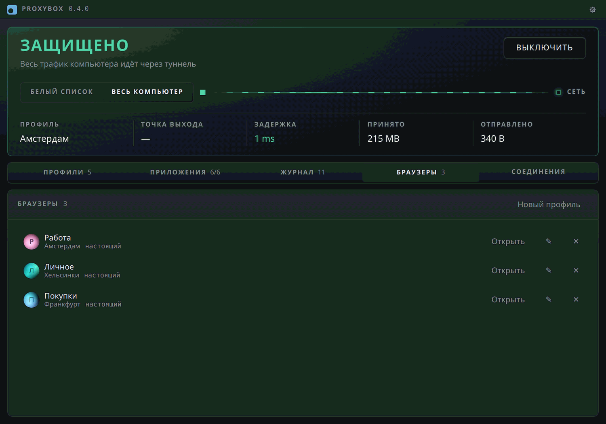

# Браузерные профили

Это часть окна (Tauri-оболочки), а она собирается только на Windows. На Linux
браузерных профилей нет вовсе — открывать окно браузера через отдельный
sing-box там пока нечему.

Вкладка «Браузеры» — отдельный список: браузерный профиль это не узел. Узел даёт
адрес, каталог сеанса — куки и входы, `ua` с `lang` — то, что о браузере узнаёт
сайт. На один узел их бывает несколько, иначе два аккаунта через одну страну не
развести. Узлом может быть и купленный SOCKS5/HTTP-прокси с логином —
Chromium сам авторизацию прокси из аргументов не умеет, а локальный sing-box
между ними её и берёт на себя (см. «Прокси» в [profiles.md](profiles.md)). В CLI — `browsers`, `add-browser --name <имя> --node <профиль>
[--ua <строка>] [--lang <языки>]`, `remove-browser --name <имя>`.

Аватарку рисует само окно из зерна профиля — три цветных пятна и первая буква
имени; нажатие на картинку в форме правки перекатывает зерно. Из того же зерна
растёт цвет значка окна браузера в панели задач, поэтому чьё окно перед вами,
видно и не читая заголовка.

Кнопка «Открыть» (в CLI — `browse --profile <имя браузерного профиля>`) поднимает
под узел этого профиля отдельный локальный прокси и открывает окно браузера через
него. Общий режим при этом не трогается: у инстанса свои порты, свой каталог и
**нет TUN**. Так и задумано — второй TUN с `auto_route` и `strict_route`
перехватил бы и исходящее соединение основного sing-box, туннели выстроились бы в
цепочку, и к задержке добавился бы целый RTT до чужого сервера. TUN держит ровно
один инстанс, общий режим.

Сеансов бывает несколько разом, по одному на браузерный профиль: два окна в двух
странах работают одновременно и друг о друге не знают. Каталог у каждого свой
(`browser/<имя>` с хвостом-хешем от имени) — `Tunnel::start` добивает процесс из
`singbox.pid`, и общий каталог означал бы, что каждый новый сеанс гасит
предыдущий. Порты тоже свои, `free_port()` на каждый.

Правил по `process_path` у этих инстансов нет: в туннель идёт тот, кто сам указал
прокси, — браузер запускается с `--proxy-server=socks5://127.0.0.1:<порт>` и своим
`--user-data-dir`. Каталог данных обязателен по двум причинам сразу: без него
Chromium передаёт аргументы уже запущенному окну и открывает обычную вкладку мимо
прокси, и он же делает профили независимыми — свои входы у каждого. Отсюда и
главная неожиданность: окно открывается **чистым**, закладок и входов из обычного
Chrome в нём нет. Свои оно помнит до следующего раза.

## Корзина, одноразовые, клоны и метки

Удалённый профиль уходит в **корзину**, а не пропадает: с каталогом сеанса ушли
бы входы во все аккаунты окна, и это единственное действие раздела, которое не
отменить. Корзина лежит внизу списка свёрнутой; из неё профиль возвращают
целиком или стирают навсегда. Стирание идёт в два шага и в обязательном порядке:
сперва оболочка сносит каталог, потом служба забывает запись. Каталог занят
открытым окном — запись остаётся, и человек видит отказ, а не пропавший профиль
с входами, оставшимися на диске. Живой сеанс при переносе в корзину гаснет
сразу, поэтому у открытого окна «В корзину» спрашивает подтверждение.

Пока профиль в корзине, **его имя новому профилю не достаётся** — ни формой, ни
командой службы. Каталог сеанса зовётся по имени, и новый профиль открылся бы с
входами удалённого.

**Одноразовый** профиль — флажок в форме: узел, user-agent и язык остаются, а
входы и куки стираются, когда окно закрыли. Стирает оболочка дважды: после
закрытия окна и перед следующим запуском, если окна нет, — оболочку могли
закрыть раньше браузера, и ждать окна тогда было некому. Пока окно открыто,
каталог не трогается: второе нажатие «Открыть» — это вкладка в том же окне.
Вкладки одноразовому не восстанавливаются.

**Клонировать** (меню «⋯» или правая кнопка по строке) открывает форму нового
профиля с тем же узлом, личностью и метками, свободным именем «… 2» и своей
аватаркой. Входы не копируются намеренно: два профиля с одними куками — это
один аккаунт в двух окнах, то есть ровно то, от чего профили и разводят.

**Метки** пишутся через запятую и отбирают список сверху — одна метка за раз.
Поиск по имени, узлу и метке появляется, когда профилей больше пяти. Держит
метки служба, как и звёздочки узлов: список тот же на второй машине.

Открытые вкладки окно тоже помнит: браузер запускается с
`--restore-last-session` и поднимает то, что было открыто, когда окно закрыли.
Флаг, а не настройка «Продолжить с того же места» в `Preferences`: стартовые
настройки Chromium подписывает и правку снаружи на Windows сбрасывает. Цена —
при открытии окна все прошлые вкладки разом идут в сеть через узел.

Прямого доступа этот путь не даёт ни на такт: умрёт его sing-box — браузер
останется без сети, прокси откажет. Закрытие окна службе не видно — она видит
живой процесс, а тот переживает браузер легко, — поэтому закрытия дожидается
оболочка и сама шлёт `browse-stop`. Отдельной кнопки «закрыть» нет за
ненадобностью; в CLI есть `browse --stop --profile <имя>`, там ждать некому.

Браузер запускает окно приложения, а не служба: служба работает в сессии 0, и её
окон человек не увидит. Движков у профиля два. Chromium ищется по порядку —
Chrome, Edge, Brave, Яндекс. Firefox — отдельным пунктом формы, и о нём ниже.
Tor Browser не годится ни тем, ни другим: он поднимает свой tor и ведёт окно
через него, то есть мимо узла.

## Firefox: защита от отпечатка

Chromium умеет подменить строку UA с подсказками, язык и часовой пояс (об этом
ниже), а всё остальное в отпечатке у него настоящее. Firefox умеет другое — `privacy.resistFingerprinting`
(RFP): отпечаток не выдумывается, а приводится к общему для всех, у кого эта
защита включена. UA, размер экрана, шрифты, canvas и часовой пояс (UTC) у них
одни и те же. Это честная одинаковость, а не правдоподобная выдумка, и
патченного браузера для неё не нужно. Строку UA такой Firefox пишет сам,
поэтому конструктора UA в форме для него нет; язык из формы действует.

Флага `--proxy-server` у Firefox нет: прокси, WebRTC и RFP живут в `user.js`
профиля, и файл пишется целиком перед каждым открытием
(`core_apps::firefox_user_js`). Профиль лежит подкаталогом `firefox` в каталоге
сеанса, так что корзина и одноразовость у обоих движков общие. Мимо узла Firefox
не уходит ни одной дверью: откат на прямое соединение выключен
(`network.proxy.failover_direct`), имена разрешает прокси (`socks_remote_dns`),
WebRTC идёт только через прокси (`ice.proxy_only`), DoH выключен. Геолокация
выключена целиком: Firefox спрашивает местоположение по окрестным точкам Wi-Fi,
и через любой прокси это настоящий адрес человека.

Запускается он с `-no-remote` — своим процессом, а не вкладкой в уже открытом
Firefox человека — и с `-wait-for-browser`: `firefox.exe` на Windows только
запускатель, и без флага сеанс гас бы сразу после старта. Окно рисует ребёнок
запускателя, поэтому значок в панели задач ищется и у детей процесса.

Проверено тестами сборки настроек, но не на живом Firefox: на машине разработки
его не было.

## Что видит сайт

`--force-webrtc-ip-handling-policy=disable_non_proxied_udp` — не украшение. SOCKS5
у Chromium везёт TCP, а WebRTC собирает кандидатов по UDP с настоящих
интерфейсов: без этого флага STUN-запрос уходит мимо прокси и сайт видит
настоящий адрес человека при поднятом туннеле.

`--user-agent` меняет строку запроса и `navigator.userAgent`. Собирает её
конструктор: платформа (настоящая, Windows, macOS, Linux), версия Chrome и
кнопка «Случайно»; готовая строка тут же и лежит, её можно вписать руками — тогда
конструктор её не переписывает, а разбирает обратно в свои поля.

Три вещи в этом конструкторе выглядят упущением, а на деле нарочны. Windows 10 и
Windows 11 не разведены по пунктам: в user-agent они неразличимы, обе —
`Windows NT 10.0`, а подсказка `Sec-CH-UA-Platform-Version` у подменённой строки
всегда та, что у Windows 10. Хвост версии всегда `0.0.0`: с версии 110 Chrome обнуляет его сам,
и настоящий номер сборки в строке был бы аномалией. Версий старше настоящей в
списке нет — такой сборки ещё нет ни у кого, а младшие обычны: не все
обновляются в тот же день.

Выбрали платформу не свою — под выбором встаёт предупреждение: подсказки и
`navigator.platform` подменяются вместе со строкой, а шрифты, отрисовка и WebGL
остаются от настоящей системы, и сайт, который сличает их со строкой, увидит
расхождение. «Уникальный» здесь значит «не такой, как у соседнего
профиля», а не «единственный такой в интернете» — второе как раз и выдаёт.

Окно сеанса получает свой значок в панели задач — цветной круг, тот же, каким
профиль помечен в списке. Иконку самого Chromium подменить нечем: она лежит в
ресурсах `chrome.exe` и аргументом не переопределяется, — зато окну можно
послать свою через `WM_SETICON`, чем оболочка и занимается, дождавшись появления
окна. Цвет считает интерфейс и передаёт строкой; `.ico` собирается байтами
(`core_apps::icon_bytes`), потому что декодер PNG ради одного круга дороже всей
затеи.

`Accept-Language` Chromium берёт не из аргументов, а из `Preferences` профиля,
поэтому язык кладётся туда до запуска. `auto` означает «по стране узла», как оно
и устроено у Dolphin Anty; страна известна из прогона профилей.

## Канал DevTools: подсказки, часовой пояс, геолокация

Трёх вещей флагами не сделать вовсе. `Sec-CH-UA` и `navigator.userAgentData`
Chromium собирает из настоящей сборки. Часовой пояс берёт у системы, а
переменную `TZ` на Windows не читает — проверено на живом Chrome: `Intl` и
`getTimezoneOffset` остаются московскими при любом её значении, то есть при
голландском адресе окно показывает любому скрипту московское время.
Геолокацию Chromium на Windows спрашивает у службы определения местоположения
— по окрестным точкам Wi-Fi, — и через любой прокси это настоящий адрес.

Всё это окно получает через DevTools-канал (`core_apps::cdp`), который
оболочка держит, пока окно открыто:

- строка UA — вместе с подсказками `Sec-CH-UA` и `navigator.platform` под неё;
- часовой пояс — «по стране узла» (по умолчанию у новых профилей), свой или
  системный. Пояс один на страну: восток США получит Нью-Йорк и в Сиэтле.
  Страна неизвестна — UTC: он ничей, а системный как раз выдаёт;
- геолокация — запрещена всем сайтам сразу.

Канал — `--remote-debugging-pipe` на унаследованных дескрипторах, а не порт
отладки на петле: к порту может подключиться любой локальный процесс любого
пользователя и забрать все куки окна, а трубу видит только оболочка. Не
открылся канал — окно не открывается вовсе: без подмены оно показало бы
настоящие пояс и местоположение под обещанием обратного.

Подмена ставится на каждую цель отдельно: вкладку, фрейм из чужого процесса,
воркер. Новая цель ждёт отладчика и запускается только после подмены — иначе
первый скрипт страницы успел бы прочитать настоящие значения. Вкладки,
восстановленные до подключения канала, ждать не умеют, и их перезагружаем один
раз. Строку UA у service worker'а подменяет `Network`, а не `Emulation`: у
воркера второго нет (замерено на Chrome 152). Проверено на живом Chrome 152:
пояс, платформа в подсказках и запрет геолокации доезжают до страницы
(`a_live_chrome_takes_the_disguise`, бежит только с `--ignored`).

Дальше начинается то, чего и каналом не сделать, и врать об этом не будем:
canvas, WebGL, WebGPU, ClientRects, аудио, шрифты, экран и
`hardwareConcurrency` настоящие и одинаковы у всех профилей одной машины, а сама
подмена через DevTools заметна тому, кто её ищет. Это разделение аккаунтов, а не
антидетект: тот делается патченным Chromium. Одинаковый для всех отпечаток без
выдумки даёт движок Firefox — выше.

