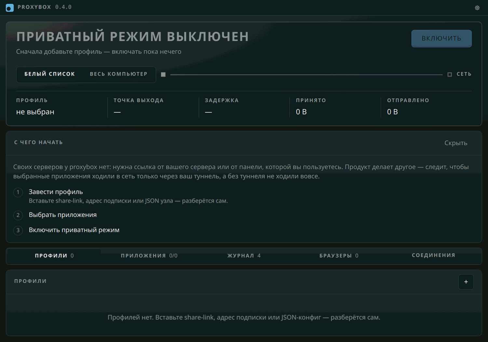

# Первые шаги

От пустого окна до работающего туннеля. Подробности каждого шага лежат
в соседних файлах, здесь — только порядок и то, обо что спотыкаются.

## Что нужно до установки

**Свой сервер или ссылка от панели.** proxybox своих серверов не даёт и не
продаёт: он не VPN-сервис, а замок к тому туннелю, который у вас уже есть.
Подойдёт share-link (`vless://`, `vmess://`, `trojan://`, `ss://`, `hysteria2://`,
`tuic://`), адрес подписки, JSON узла sing-box или конфиг Clash-YAML — всё это
вставляется в одно поле, и служба сама разбирает, что ей дали.

**Windows 10 или 11** и **права администратора**. Без них не поднять ни TUN, ни
правила брандмауэра, то есть приватного режима не будет вовсе.

## Установка

Скачайте установщик из [релизов](https://github.com/Gerrux/proxybox/releases) и
запустите. Он зарегистрирует службу и положит рядом sing-box.

Подписи у сборки нет — сертификата у проекта нет тоже, — поэтому SmartScreen
предупредит: «Подробнее» → «Выполнить в любом случае». Разбор установки целиком,
вместе с обновлением поверх и соседством с чужим VPN, — в
[install.md](install.md).

Из исходников — [development.md](development.md).

## Три шага в окне

На первом запуске окно показывает карточку «С чего начать»: те же три шага, и
отмечаются они сами, по настоящему состоянию службы. Прошли все три — карточка
уходит навсегда.

Мастера с кнопками «далее» и «пропустить» тут нет намеренно. Профиль заводят и
из консоли, и вставкой в панель, а приватный режим включают кнопкой в шапке —
шаг мастера разошёлся бы с настоящим состоянием немедленно. Карточка же ничего
не помнит: каждая отметка — это вопрос к службе, поэтому соврать она не может.

### 1. Завести профиль

Панель «Профили», кнопка «+» (или крупная кнопка «Импорт» в пустом списке).
Вставьте ссылку — подпись под полем скажет, что в ней увидели: адрес подписки,
ссылку на узел, JSON или сколько строк вставили разом. Подписка приносит все свои
узлы сразу и дальше сверяется сама, раз в несколько часов.

Ответом приезжает счёт: заведено, уже было, пропущено. Пропущенные — это узлы
тех протоколов, которых продукт не понимает; про них написано в
[profiles.md](profiles.md).

Кнопка «Прогнать» померяет все узлы и подпишет строки задержкой и страной
выхода. На подписке в сотню узлов это минуты — отдельный узел меряется из его
меню.

### 2. Выбрать приложения

Панель «Приложения», «Найти» — служба обойдёт реестр, меню «Пуск» и пакеты Store
и покажет, что установлено; чего не нашла, добавляется путём к `.exe` руками.
Отметьте те, которым нужен туннель.

Этот шаг нужен только в охвате **«белый список»**. Переключатель охвата стоит в
шапке окна, у левого конца канала:

- **Белый список** — сеть есть только у отмеченных приложений и только через
  туннель. У всех остальных сети нет вовсе, пока приватный режим включён.
- **Весь компьютер** — отбора нет, в туннель идёт всё, включая трафик, за
  которым не стоит процесс: службы, драйверы, DNS. Список приложений тут не
  участвует.

Пустой белый список запирает машину целиком — это не ошибка, а прямое следствие:
пропуска раздаются по списку, а пустой список это ноль пропусков. Окно об этом
предупреждает заранее.

### 3. Включить

Кнопка в шапке. Дальше:

- **«Подключение…»** — sing-box поднялся, но проба ещё не подтвердила туннель.
  Сети в этот момент нет ни у кого: обещание держится с первой секунды, а не с
  той, когда всё сложилось.
- **«Защищено»** — туннель подтверждён, выбранные приложения получили пропуска.
- **«Туннеля нет — доступ закрыт»** (янтарный) — так выглядит **сработавшая**
  защита, а не поломка. Узел не отвечает, и выбранные приложения сидят без сети,
  вместо того чтобы уйти напрямую. Причина, если sing-box её записал, стоит в
  ленте рядом.
- **Красный** — вот это уже поломка: служба не отвечает или правила не встали.

## Если что-то не работает

Первая команда — `proxybox doctor` в консоли. Он проверяет не наш код, а
окружение: отвечает ли служба, нашёлся ли sing-box, работает ли Base Filtering
Engine, запущено ли всё от администратора, не включён ли системный прокси и не
подняты ли рядом чужие TUN-адаптеры, которые спорят с нашим за маршруты.

Самое частое:

| Что видно | Что это |
| --- | --- |
| «Служба не отвечает» | служба не запущена или запущена без прав администратора |
| «Доступ закрыт» сразу после включения | узел не отвечает — проверьте его прогоном, смените профиль |
| Сеть пропала у **всех** приложений | охват «белый список» с пустым или неверным списком |
| Приложение без сети, хотя отмечено | путь к `.exe` изменился (обновление Chrome, Discord, Steam) — переотметьте |
| Дочерний процесс без сети | пропуск стоит на конкретный `.exe`, родительские связи не отслеживаются |

Мёртвый узел сам не сменяется: перебора по кругу продукт не делает, профиль
выбирает человек. Это и остальные известные дыры — в
[limitations.md](limitations.md).

Журналы открываются кнопкой в настройках; лежат они в
`%ProgramData%\proxybox\`.

## Дальше

| | |
| --- | --- |
| [Как это работает](how-it-works.md) | почему отбор в брандмауэре, а не в конфиге, и что с DNS |
| [Профили и подписки](profiles.md) | форматы ссылок, Clash-YAML, прогон узлов |
| [Браузерные профили](browser-profiles.md) | несколько аккаунтов через разные узлы |
| [Окно](interface.md) | соединения, язык, трей и плашка, настройки |
| [Чего ещё нет](limitations.md) | известные дыры по цене ошибки |
